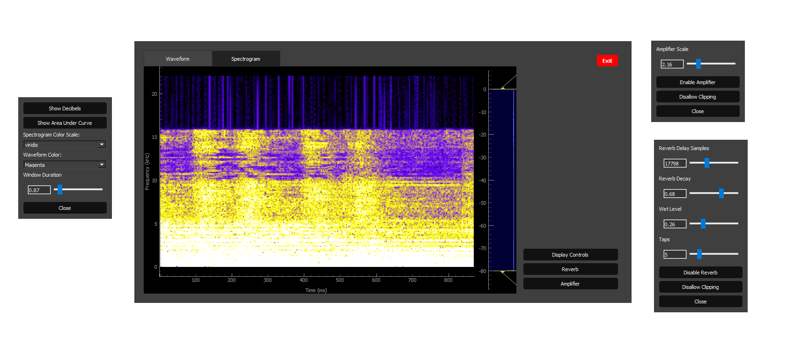

<!-- Project image -->
<p align="center">
  
</p>

# Audio Visualizer & Recorder

This project is a Python-based suite for practicing Digital Signal Processing (DSP) concepts. It provides real-time audio visualization, recording, playback, and passthrough, with a PyQt5/pyqtgraph GUI for waveform and spectrogram display. Additionaly a collection of audio effects plugins are included for manipution of audio waveforms.

## Architecture
- **signal_processing/:** An audio processing backend using python sounddevice for I/O and a plugin based audio processing archticture. A major goal of the project is to support plugin chains and mixing alongside the ability to visualize the waveforms at different points throughout a chain.

- **visualizer/:** PyQt5 application for playback, recording, and visualization of audio waveforms. The GUI consists of a waveform/spectrogram display and several audio plugin popups.

- **message_bus.py:** Message bus for communication between fron and backend implemented via Multiprocessing.Queue.

## Usage

```
usage: main.py [-h] [--input_device INPUT_DEVICE] [--output_device OUTPUT_DEVICE] [--wav_path WAV_PATH]
               [--list_devices] [--mode {playback,record,passthrough}] [--log_level LOG_LEVEL]
               [--save_recording] [--in_ch IN_CH] [--out_ch OUT_CH]

Audio loopback recorder

options:
  -h, --help            show this help message and exit
  --input_device INPUT_DEVICE
                        Input device index (default: prompt)
  --output_device OUTPUT_DEVICE
                        Output device index (default: prompt)
  --wav_path WAV_PATH   Path to WAV file for playback mode
  --list_devices        List available audio devices and exit
  --mode {playback,record,passthrough}
                        Operation mode: playback, record, or passthrough (default: passthrough)
  --log_level LOG_LEVEL
                        Logging level (DEBUG, INFO, WARNING, ERROR, CRITICAL)
  --save_recording      Save recording in passthrough mode
  --in_ch IN_CH         Number of channels to use for input (default: device max)
  --out_ch OUT_CH       Number of channels to use for output (default: device max)
```
